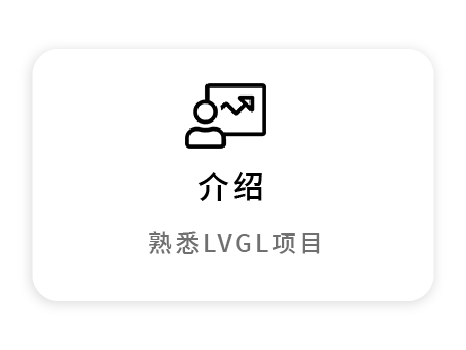
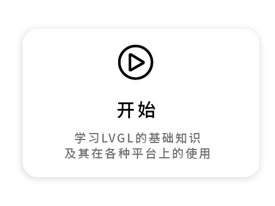
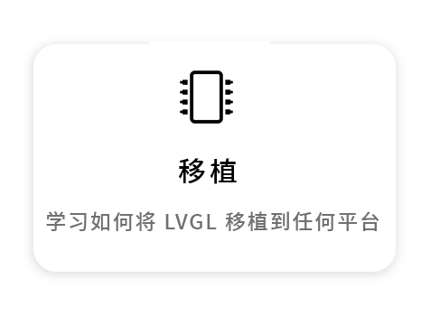
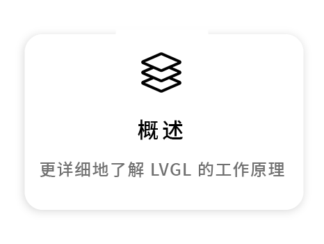
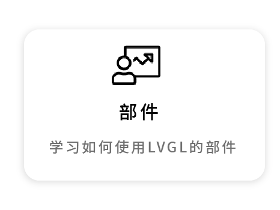
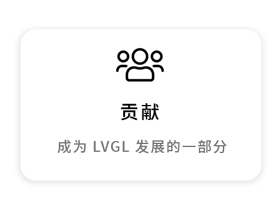

```eval_rst
.. include:: /header.rst 
:github_url: |github_link_base|/index.md
```

```eval_rst

PDF version: :download:`100ASK_LVGL_CN.pdf <100ASK_LVGL_CN.pdf>`

```

# 欢迎阅读百问网LVGL中文开发手册！

<a href="https://www.100ask.net/index"></a>


<div style="margin-bottom:48px"> 
    <a href="intro/index.html"></a>
    <a href="get-started/index.html"></a>
    <a href="porting/index.html"></a>
    <a href="overview/index.html"></a>
    <a href="widgets/index.html"></a>
    <a href="CONTRIBUTING.html"></a>
</div> 

# 百问网LVGL视频教程(韦东山·监制)

教程基于lvgl v8.1版本，适配多个平台、多款板子。

视频地址：[https://www.bilibili.com/video/BV1Ya411r7K2](https://www.bilibili.com/video/BV1Ya411r7K2)


```eval_rst
.. toctree::
   :maxdepth: 2
   
   intro/index
   examples
   get-started/index
   porting/index
   overview/index
   widgets/index
   layouts/index
   libs/index
   others/index
   CONTRIBUTING
   CHANGELOG
   ROADMAP
   100ask_project/index
   contact_us/index
```
